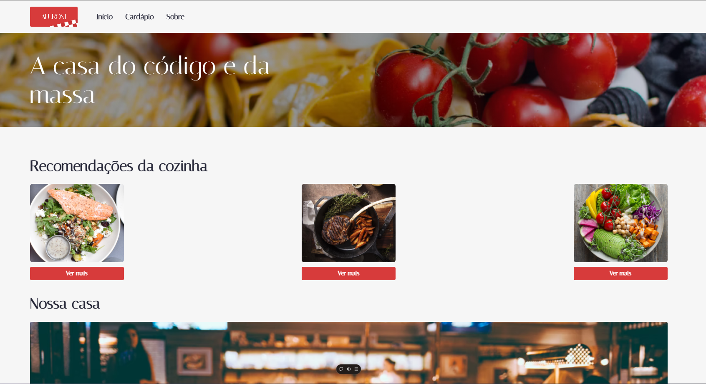
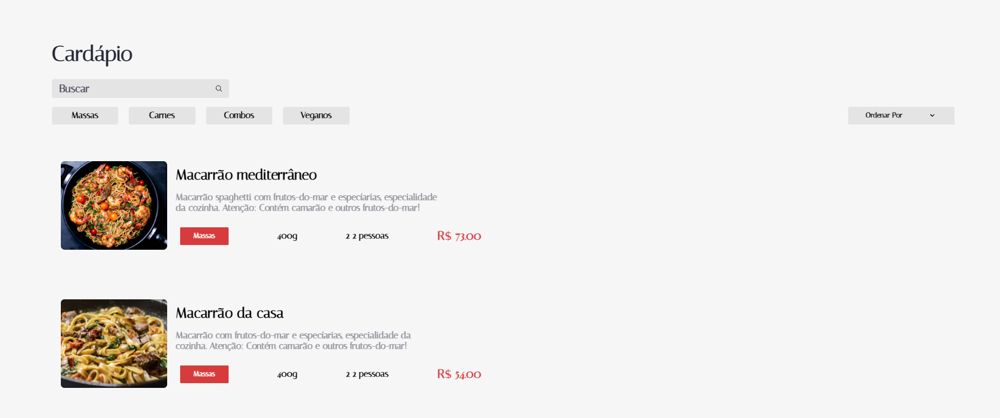

# Aluroni

Este projeto é um aplicativo de restaurante especializado em massas, desenvolvido durante o curso da **Alura**, com o objetivo de aprender sobre **React** e a biblioteca **React Router**, utilizando **TypeScript**. O aplicativo tem foco em navegação entre rotas e na exibição dinâmica de informações sobre os pratos.

## 🛠 Tecnologias Utilizadas

- **React** (versão 17.0.2)
- **React Router Dom** (versão 6.2.1)
- **TypeScript** (versão 4.5.5)
- **React Icons** para ícones de interface
- **Classnames** para manipulação de classes CSS
- **Normalize.css** para estilização consistente entre navegadores
- **SASS** para criação de estilos personalizados

## 🌟 Funcionalidades Principais

- **Página Principal**: Exibe três pratos aleatórios toda vez que a página é atualizada. Cada prato possui um botão "Ver mais", que redireciona o usuário para uma página com mais detalhes.
- **Rota Cardápio**: Lista todos os pratos disponíveis no restaurante. Ao clicar em um prato, o usuário é direcionado para uma página dedicada com todas as informações detalhadas sobre ele.
- **Rota Sobre**: Fornece informações sobre o restaurante, como sua história e especialidades.
- **Navegação Dinâmica**: Utilização do React Router para facilitar a transição entre as rotas e melhorar a experiência do usuário.

## 📸 Imagens e Demonstração

Para melhor ilustrar o funcionamento do projeto, aqui estão algumas imagens prévias da interface principal:




## 🚀 Como Rodar o Projeto

1. Clone o repositório:

   ```bash
   git clone https://github.com/Fabricio-santuchi/Aluroni.git
   ```

2. Acesse o diretório do projeto:

   ```bash
   cd Aluroni
   ```

3. Instale as dependências:

   ```bash
   npm install
   ```

4. Inicie o servidor de desenvolvimento:

   ```bash
   npm start
   ```

5. Acesse o projeto no navegador:

   O projeto será aberto no endereço `http://localhost:3000`.

## 🌐 Acessar o Projeto Online

O projeto está disponível online através da **Vercel**. Você pode acessá-lo clicando no link abaixo:

[Aluroni - Vercel](https://aluroni.vercel.app)

## 📂 Estrutura de Pastas

```bash
aluroni/
│
├── node_modules/          # Dependências do Node.js
├── public/                # Arquivos públicos
│   ├── index.html         # Página inicial
│   └── favicon.ico        # Ícone do projeto
│
├── src/                   # Diretório principal de código-fonte
│   ├── components/        # Componentes React do projeto
│   │   ├── Header/        # Cabeçalho com navegação
│   │   ├── Footer/        # Rodapé do site
│   │   └── DishCard/      # Cartões individuais dos pratos
│   ├── pages/             # Páginas acessíveis por rotas
│   │   ├── Home/          # Página principal com pratos aleatórios
│   │   ├── Cardapio/      # Página com todos os pratos
│   │   ├── Sobre/         # Página "Sobre"
│   │   └── Prato/         # Página de detalhes de um prato
│   ├── routes/            # Configuração das rotas
│   ├── styles/            # Arquivos de estilo (CSS/SASS)
│   ├── App.tsx            # Componente principal da aplicação
│   ├── index.tsx          # Ponto de entrada da aplicação
│   └── react-app-env.d.ts # Configurações TypeScript
│
├── .gitignore             # Arquivo Gitignore
├── package.json           # Configurações do projeto e dependências
├── tsconfig.json          # Configuração do TypeScript
└── README.md              # Documentação do projeto
```

## 📜 Scripts Disponíveis

- **`npm start`**: Inicia o servidor de desenvolvimento.
- **`npm run build`**: Cria uma versão otimizada para produção.
- **`npm test`**: Executa os testes do projeto.

## 📦 Dependências

- **React**: Biblioteca JavaScript para construção de interfaces de usuário.
- **React Router Dom**: Navegação entre rotas no React.
- **TypeScript**: Tipagem estática para JavaScript.
- **Classnames**: Manipulação condicional de classes CSS.
- **Normalize.css**: Garantia de consistência de estilos entre navegadores.

### 🛠 Dependências de Desenvolvimento

- **@typescript-eslint**: Linter para TypeScript.
- **ESLint**: Ferramenta para identificar problemas no código.
- **SASS**: Pré-processador CSS para maior controle de estilos.

## 📚 Sobre o Projeto

O **Aluroni** foi desenvolvido como parte do curso da **Alura**, com o objetivo de aprender e aplicar conceitos fundamentais do **React**, como componentes, estados, props e rotas utilizando a biblioteca **React Router DOM**. O foco deste curso foi principalmente em **TypeScript** e **React Router DOM**, permitindo uma compreensão mais profunda de como integrar rotas dinâmicas e tipagem estática em aplicações React. Este projeto ajudou a consolidar habilidades práticas em **TypeScript** e estilização com **CSS Modules**.

## ✍️ Autor

**Fabrício Santuchi**  
Estudante de **Sistemas de Informação** e desenvolvedor front-end. Apaixonado por criar interfaces dinâmicas e intuitivas, sempre buscando aprender novas tecnologias para melhorar a experiência do usuário.